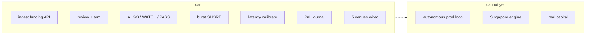
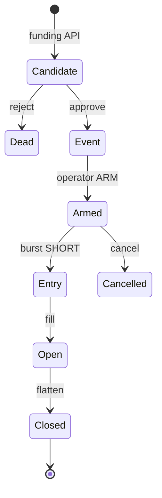
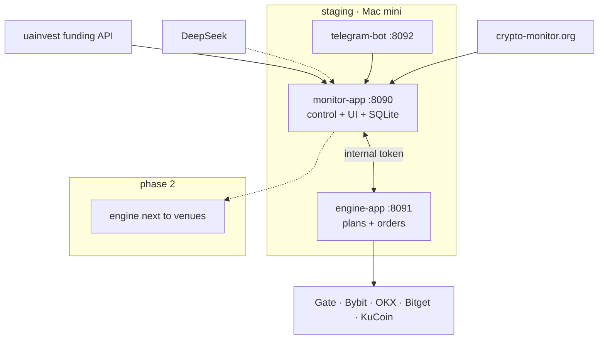
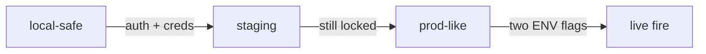

<div align="center">

# FUND `2.0.0`

operator desk for the 1–5s window **before** funding

[monitor](https://crypto-monitor.org) · [docs](docs/README.md) · [status](docs/PROJECT_STATUS.md) · [bot](https://t.me/funding_arbitrage_bot_bot)

[](https://github.com/mishaivchenko/crypto/actions)
[](#)
[](#status)
[](https://crypto-monitor.org)
[](#status)

</div>

---

## status

| plane | where | state |
| --- | --- | --- |
| **monitor** `:8090` | [crypto-monitor.org](https://crypto-monitor.org) · Mac mini + Cloudflare Tunnel | `UP` · `prod-like` |
| **engine** `:8091` | same host as monitor | `UP` · loop **off** · live orders **off** |
| **telegram** `:8092` | `@funding_arbitrage_bot_bot` | `UP` · `staging` |
| **prod / SG** | not deployed | `NO` |
| **real size** | — | `NO` |

```
Phase 0 ██████████░░░░  foundation
Phase 1 ░░░░░░░░░░░░░░  harden
Phase 2 ░░░░░░░░░░░░░░  go-live SG + capital
```

MVP 1–6 done. Last confirmed live fill: **Gate testnet · ACT/USDT SHORT · 2026-05-09**.

---

## can / cannot



| capability | label |
| --- | --- |
| signal ingest + dedupe | `LIVE` |
| operator review / reject | `LIVE` |
| arm SHORT + burst entry | `LIVE` |
| DeepSeek advisor | `LIVE` |
| liquidity score | `LIVE` |
| cancel from any cancellable state | `LIVE` |
| position → exit → outcome | `LIVE` |
| trade history UI | `LIVE` |
| venue diagnostics + p50/p95/p99 | `LIVE` |
| Gate testnet fill | `PROVEN` |
| Bybit from UA | `VPN` |
| engine loop on prod | `LOCKED` |
| live orders on prod | `LOCKED` |
| SG co-location | `PLANNED` |

---

## loop



Thesis: **SHORT 1–5s before the tick, ride the dump, flatten. Do not collect the coupon.** Human ARM is required.

---

## topology



| module | job |
| --- | --- |
| `platform-core` | domain only |
| `monitor-app` | queue, arm, creds, UI |
| `engine-app` | fire · cannot mutate event/trade |
| `telegram-bot-app` | alerts |

---

## venues

| | creds | meta | orders | note |
| --- | :---: | :---: | :---: | --- |
| **Gate** | ● | ● | ● | testnet SHORT filled |
| **Bybit** | ● | ● | ● | UA geo-block |
| **OKX** | ● | ● | ● | `x-simulated-trading: 1` |
| **Bitget** | ● | ● | ● | passphrase |
| **KuCoin** | ● | ● | ● | passphrase |

wired ≠ edge.

---

## kill switches



| flag | default |
| --- | --- |
| `ENGINE_EXECUTION_LOOP_ENABLED` | `false` |
| `ENGINE_LIVE_ORDER_ENABLED` | `false` |
| max concurrent armed | `3` |
| side | `SHORT` only |

Local `bootRun*` is dead on exchanges.

---

## run

```bash
./gradlew bootRunMonitor   # :8090
./gradlew bootRunEngine    # :8091
```

```bash
cp deploy/.env.example .env && docker compose up --build
```

JDK 25. Commands → [`AGENTS.md`](AGENTS.md)

---

## map

| want | go |
| --- | --- |
| now | [docs/00-current-state.md](docs/00-current-state.md) |
| phases | [docs/PROJECT_STATUS.md](docs/PROJECT_STATUS.md) |
| safety | [docs/08-safety.md](docs/08-safety.md) |
| runbook | [docs/07-runbook.md](docs/07-runbook.md) |
| API | [docs/04-api-surface.md](docs/04-api-surface.md) |
| engine spec | [docs/engine-tdd/](docs/engine-tdd/) |

Private desk. Staging is on. Capital is not.
