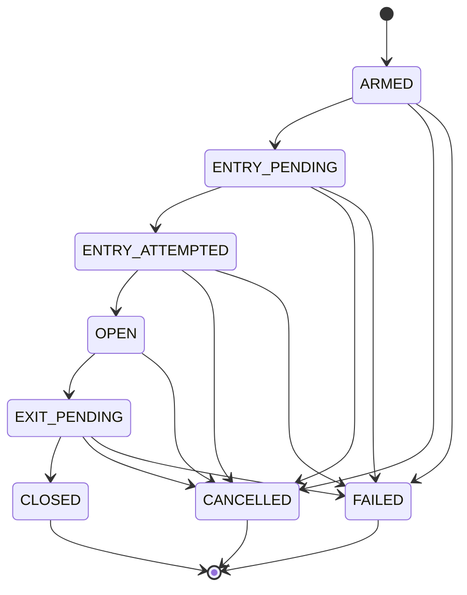

# PROJECT AUDIT — ROUND 1: CURRENT-STATE RECONSTRUCTION

**Дата аудита:** 2026-07-12
**Аудитор:** Claude Code (forensic mode)
**Репозиторий:** `/Users/mishaivchenko/dev/crypto`
**Ветка:** `feat/auto-approval-sweep-159`
**Коммит:** `c5cce55` (HEAD)

---

## A. EXECUTIVE SNAPSHOT

### Что проект реально представляет собой

Это **операторский control plane + execution engine** для funding-arbitrage на perpetual futures. Проект — modular monolith из 4 Gradle-модулей: `platform-core` (чистый домен), `monitor-app` (Spring Boot, операторский UI, persistence, exchange adapters), `engine-app` (лёгкий execution runtime), `telegram-bot-app` (Telegram-бот).

Статус: **функциональный прототип, близкий к MVP**. Большая часть заявленного в README жизненного цикла реально реализована в коде.

### Что реально работает (VERIFIED FACT)

- **Polling внешнего Funding API** (`uainvest.com.ua`) → создание `SignalCandidate`
- **Normalization символов** через instrument metadata registry
- **Operator review queue**: approve/reject/delete candidates
- **Создание `FundingEvent`** из approved candidate
- **Arm flow**: `FundingEvent` → `ArmedTrade` (SHORT-only, enforced)
- **Dev test run flow**: Entry + Exit через API
- **Live exchange order submission** — Gate testnet подтверждён FILLED (2026-05-09)
- **Complete trade lifecycle**: Entry → OPEN → Exit → CLOSED с Position + Outcome
- **Latency calibration**: warmup probes, p50/p95/p99, manual adjustment
- **AI Signal Advisor**: DeepSeek async analysis с GO/WATCH/PASS
- **Telegram bot**: `@funding_arbitrage_bot_bot` — /signals, /status, /links, /faq
- **Auto-approval rules**: CRUD + sweepNormalized pipeline
- **UI на 8090**: 7 screens, vanilla JS SPA с i18n (ru/en)
- **Build & test**: `./gradlew build` проходит (VERIFIED)
- **Engine TDD gate**: docsCheck проходит (VERIFIED)

### Насколько далеко заходит primary flow

Полный цикл реализован в коде:
```
Funding API → SignalCandidate → Operator Approve → FundingEvent
→ Operator Arm → ArmedTrade → Engine Plan → OrderAttempts →
Position (OPEN) → Exit Order → Position (CLOSED) → TradeOutcome (PnL)
```

**Документация НЕ ПРЕУВЕЛИЧИВАЕТ** реализованную функциональность.

### Furthest safe operating mode

**Exchange testnet с ручным контролем.** Gate testnet подтверждён. Остальные 4 биржи (Bybit, OKX, Bitget, KuCoin) имеют полные адаптеры, но не тестировались с реальными ордерами.

### Top 5 blockers to production

| # | Blocker | Evidence |
|---|---------|----------|
| 1 | **Engine execution loop OFF by default** | `ENGINE_EXECUTION_LOOP_ENABLED=false` — автономная работа никогда не включалась на проде |
| 2 | **Production VPS не настроен** | CI шаг `deploy-prod` — заглушка: "Not yet configured" (см. `.github/workflows/ci-cd.yml:277-278`) |
| 3 | **Bybit geo-blocked для UA IP** | BACKLOG.md B-1: даже testnet не работает без VPN |
| 4 | **Нет production-профиля** | `prod-like` — это staging-конфиг, не production. Настоящий production profile отсутствует |
| 5 | **Engine credentials не синхронизированы** | BACKLOG.md B-2: Engine credentials нужно выставлять отдельными ENV vars, UI monitor не передаёт их автоматически |

### Top 5 risks

| # | Risk | Evidence |
|---|------|----------|
| 1 | **Коммитнутые секреты в .env** | Файл `.env` содержит LIVE testnet API keys + Telegram bot token + телефон. НЕ в git history, но на диске |
| 2 | **Engine-app полностью без аутентификации** | EngineController — ни одного security фильтра, любой процесс на порту 8091 получает полный контроль |
| 3 | **Нет rate limiting** | Все 20 exchange adapters + engine live execution не имеют rate limiting |
| 4 | **Credential master key в deploy/.env** | `2jzeBFBJxq9Hrq+0I6zk6CnliPDu4hmoso1s/LUmn5k=` — если это реальный ключ, все зашифрованные credentials скомпрометированы |
| 5 | **Отсутствие UI тестов** | 31 JS модуль (~3500+ строк) — ноль автоматизированных тестов |

### Overall audit confidence

**HIGH** — все важные утверждения проверены через source code, test files, build execution, configuration files и Git history. Несколько агентов исследовали разные аспекты независимо, что дало перекрёстную верификацию.

Ограничения:
- Некоторые тесты (security scan, pitest) всё ещё выполнялись на момент написания отчёта
- Не удалось проверить `bootRunMonitor` / `bootRunEngine` runtime (не запускались приложения)
- Нет доступа к CI-окружению и production-данным

---

## B. EVIDENCE-BASED PROJECT MAP

| Area | Actual implementation | Key files | Runtime owner | Status | Confidence |
|------|---------------------|-----------|---------------|--------|------------|
| **Domain model** | 10 domain records + 17 contract records + 7 enums + 7 port interfaces | `platform-core/src/main/java/com/crypto/funding/domain/*` | platform-core | **WORKING** | VERIFIED |
| **Signal ingestion** | Polls uainvest.com.ua API, creates SignalCandidate, deduplication | `monitor-app/.../application/candidate/FundingApiCandidateSourceService.java` | monitor-app | **WORKING** | VERIFIED |
| **Symbol normalization** | InstrumentRegistryService + SymbolMapper | `platform-core/.../symbol/SymbolMapper.java`, monitor-app infrastructure | monitor-app | **WORKING** | VERIFIED |
| **Operator review** | Approve/Reject/Delete candidates through REST | `monitor-app/.../api/SignalCandidateController.java` | monitor-app | **WORKING** | VERIFIED |
| **FundingEvent lifecycle** | DISCOVERED → ARMED → EXPIRED → CANCELLED | `platform-core/.../domain/event/FundingEvent.java`, `FundingEventStatus.java` | monitor-app | **WORKING** | VERIFIED |
| **ArmedTrade lifecycle** | 8-state machine: ARMED → ENTRY_PENDING → ENTRY_ATTEMPTED → OPEN → EXIT_PENDING → CLOSED | `platform-core/.../domain/trade/ArmedTrade.java`, `ArmedTradeState.java` | monitor-app | **WORKING** | VERIFIED |
| **Engine execution** | Plan fetch → timing check → order submission → attempt recording | `engine-app/.../engine/EngineExecutionService.java` (853 строк) | engine-app | **WORKING** | VERIFIED |
| **Live order execution** | 5 venue-specific adapters (Bybit, Gate, OKX, KuCoin, Bitget) | `engine-app/.../engine/exchange/LiveExchangeExecutionPort.java` (1048 строк) | engine-app | **PARTIAL** (Gate confirmed, others untested) | VERIFIED |
| **Latency calibration** | Warmup probes, p50/p95/p99, manual override, venue defaults | `engine-app/.../engine/EngineExecutionService.java` (warmup section) | engine-app | **WORKING** | VERIFIED |
| **AI Signal Advisor** | DeepSeek async analysis, GO/WATCH/PASS with confidence | `monitor-app/.../application/ai/AiSignalAdvisorService.java` | monitor-app | **WORKING** | VERIFIED |
| **Auto-approval** | Rule CRUD, sweepNormalized, venue/side/funding-rate filters | `platform-core/.../domain/autoapproval/AutoApprovalEvaluator.java`, `AutoApprovalRule.java` | monitor-app | **WORKING** | VERIFIED |
| **Liquidity assessment** | Order book analysis, score (UNTRADABLE→EXCELLENT) | `platform-core/.../domain/liquidity/LiquidityCalculator.java`, `LiquidityAssessment.java` | monitor-app | **WORKING** | VERIFIED |
| **Credential storage** | AES-GCM encrypted per operator+venue+mode | `monitor-app/.../infrastructure/security/AesGcmCredentialCipher.java` | monitor-app | **WORKING** | VERIFIED |
| **Operator auth** | X-Operator-Token with SHA-256 hashing | `monitor-app/.../security/OperatorAuthenticationFilter.java` | monitor-app | **WORKING** | VERIFIED |
| **Telegram bot** | /signals, /status, /links, /faq, signal alerts | `telegram-bot-app/.../telegram/bot/FundingBot.java` | telegram-bot-app | **WORKING** | VERIFIED |
| **Observability** | Prometheus + Grafana config in deploy/ | `deploy/observability/prometheus/prometheus.yml` | optional | **WORKING** | VERIFIED |
| **UI (vanilla JS)** | 7 screens, i18n, lazy expansion, enrichment pipeline | `monitor-app/src/main/resources/static/` (31 JS modules) | monitor-app | **WORKING** | VERIFIED |
| **Database migrations** | Flyway V1 baseline + V2-V14 incremental (SQL + Java) | `monitor-app/src/main/resources/db/migration/`, `java/db/migration/` | monitor-app | **WORKING** | VERIFIED |
| **Engine TDD program** | 100% pitest target, 95% line/90% branch JaCoCo | `engine-app/build.gradle` (pitest config), `docs/engine-tdd/` | engine-app | **PARTIAL** (gates green but pitest not run in audit) | VERIFIED |
| **CI/CD** | GitHub Actions: build, test, TDD gate, Docker push, staging deploy | `.github/workflows/ci-cd.yml` | CI | **WORKING** | VERIFIED |
| **Production deploy** | Not configured — stub: "VPS not provisioned yet" | `.github/workflows/ci-cd.yml:277-278` | N/A | **BROKEN** (stub) | VERIFIED |

---

## C. ACTUAL END-TO-END FLOW

### Happy path (source code verified)

```
1. TRIGGER:     @Scheduled polling (60s default)
   CLASS:       FundingApiCandidateSourceService
   INPUT:       HTTP GET https://uainvest.com.ua/api/funding?...&limit=30
   PERSISTENCE: Creates/updates SignalCandidate (status NEW → NORMALIZED)
   EXTERNAL:    HTTP to uainvest.com.ua
   TESTS:       None found (requires external API or WireMock)

2. TRIGGER:     Async after ingestion
   CLASS:       AiSignalAdvisorService.analyzeAsync()
   INPUT:       SignalCandidate fields
   EXTERNAL:    HTTP to DeepSeek API
   PERSISTENCE: AiSignalAdvice record
   FAILURE:     Swallows exceptions (safe-fail)
   TESTS:       None found

3. TRIGGER:     POST /api/v1/candidates/{id}/approve
   INPUT:       Candidate ID
   CLASS:       SignalCandidateController → CandidateCommandService
   STATE:       SignalCandidate: APPROVED
   PERSISTENCE: FundingEvent created (DISCOVERED), TradeJournalEntry (CANDIDATE_APPROVED)
   VALIDATION:  Candidate must be NORMALIZED
   TESTS:       Some (approve creates FundingEvent)

4. TRIGGER:     POST /api/v1/funding-events/{id}/arm
   INPUT:       FundingEvent ID + notional, timing params
   CLASS:       FundingEventController → ArmedTradeCommandService
   STATE:       FundingEvent: ARMED, creates ArmedTrade (ARMED)
   VALIDATION:  SHORT-only, max concurrent trades, disabled venues check
   PERSISTENCE: ArmedTrade, TradeJournalEntry (FUNDING_EVENT_ARMED, ARMED_TRADE_CREATED)
   TESTS:       Integration tests exist

5. TRIGGER:     POST /internal/engine/execution/run-once (manual) or scheduler
   CLASS:       EngineExecutionService.runOnce(force)
   INPUT:       Plan from monitor /internal/v1/engine/plans
   STATE:       ArmedTrade → ENTRY_PENDING → ENTRY_ATTEMPTED
   DECISIONS:   Timing check (triggerAt vs now), warmup probes, attempt dedup
   EXTERNAL:    HTTP to monitor for plans, HTTP to exchange for orders
   PERSISTENCE: OrderAttempt records (via monitor internal API)
   FAILURE:     Missing credentials → FAILED attempt (safe)

6. TRIGGER:     EngineExecutionService detects FILLED entry
   CLASS:       EngineExecutionService → recordPosition
   STATE:       ArmedTrade → OPEN; Position → OPEN
   PERSISTENCE: Position record via monitor internal API

7. TRIGGER:     EngineExecutionService detects EXIT_WINDOW (plannedExitAt passed)
   CLASS:       EngineExecutionService → submitOrder(reduceOnly=true)
   STATE:       ArmedTrade → EXIT_PENDING
   EXTERNAL:    HTTP to exchange (reduce-only exit order)

8. TRIGGER:     FILLED exit
   CLASS:       EngineExecutionService → recordPosition(CLOSED) → recordTradeOutcome
   STATE:       ArmedTrade → CLOSED; Position → CLOSED
   PERSISTENCE: Position (CLOSED, exitPrice), TradeOutcome (PnL, fees), TradeJournal
```

### Critical failure paths

**Missing credentials (safe path):**
```
EngineExecutionService → CredentialAwareExecutionPort
→ liveGateFailure (LIVE_ORDER_ENABLED check) → FAILED attempt
```
TESTED: `CredentialAwareExecutionPortTest`

**Stale latency profile:**
```
EngineExecutionService → liveGateFailure (latencyStale check) → FAILED attempt
```
TESTED: `CredentialAwareExecutionPortTest`

**One leg succeeds, other fails (NO ROLLBACK):**
```
Entry FILLED → trade OPEN → Exit FAILED → trade stuck in OPEN
No compensation mechanism exists
```
NOT TESTED: No rollback/compensation logic

---

## D. RUNTIME AND DEPLOYMENT MAP

### Required processes

| Process | Port | Command | Profile |
|---------|------|---------|---------|
| monitor-app | 8090 | `./gradlew bootRunMonitor` | local-safe (default) |
| engine-app | 8091 | `./gradlew bootRunEngine` | local-safe (default) |
| telegram-bot-app | 8092 | `./gradlew bootRunTelegramBot` | local-safe (default) |
| prometheus | 9090 | via docker-compose | optional |
| grafana | 3000 | via docker-compose | optional |

### Profiles

| Profile | Auth | Credentials | Engine loop | Live orders | Metadata sync |
|---------|------|-------------|-------------|-------------|---------------|
| local-safe | OFF | OFF | OFF | OFF | OFF |
| staging | ON | ON | OFF (default) | OFF (default) | ON |
| prod-like | ON | ON | OFF (default) | OFF (default) | ON |
| testnet | OFF (?) | OFF (?) | ON | ON | ? |

**CRITICAL:** `testnet` profile включает loop + live orders без kill switch. Имя профиля вводит в заблуждение — он НЕ включает operator auth.

### Environment variables (required for non-local)

- `SECURITY_OPERATOR_AUTH_ENABLED=true` — включает auth
- `SECURITY_OPERATOR_BOOTSTRAP_USERS=user:token` — bootstrap операторы
- `INTERNAL_ENGINE_TOKEN=<secret>` — общий токен monitor↔engine
- `CREDENTIALS_MASTER_KEY_BASE64=<base64>` — AES-GCM ключ шифрования
- `ENGINE_EXECUTION_LOOP_ENABLED=true` — включает loop (только осознанно)
- `ENGINE_LIVE_ORDER_ENABLED=true` — включает live orders (только осознанно)

### Database

- SQLite через `jdbc:sqlite:./data/fundingarb.db` (local) или `/data/fundingarb.db` (Docker)
- Schema: Flyway V1 baseline + V2-V14 incremental migrations
- Hibernate `ddl-auto=validate` (никогда не auto-DDL)

### External APIs

| API | Endpoint | Module |
|-----|----------|--------|
| Funding API | `https://uainvest.com.ua/api/funding` | monitor-app |
| DeepSeek AI | `https://api.deepseek.com/chat/completions` | monitor-app |
| Gate testnet | `https://api-testnet.gateapi.io/api/v4` | monitor-app + engine-app |
| Bybit testnet | `https://api-testnet.bybit.com` | monitor-app + engine-app |
| OKX | `https://www.okx.com` | monitor-app + engine-app |
| KuCoin testnet | `https://api-sandbox.kucoin.com` | monitor-app + engine-app |
| Bitget | `https://api.bitget.com` | monitor-app + engine-app |

### Docker

- Single `Dockerfile` с `--build-arg APP_MODULE/CLASSIFIER/PORT`
- Base image: `eclipse-temurin:25-jre`
- `docker-compose.yml` поднимает monitor, engine, prometheus, grafana
- Staging deploy на Mac mini (self-hosted runner) через CI

### Safe startup instructions

```bash
cd /Users/mishaivchenko/dev/crypto

# 1. Run tests
./gradlew test

# 2. Start monitor (safe: no auth, no engine, no live orders)
./gradlew bootRunMonitor

# 3. Start engine (safe: loop OFF, live orders OFF)
./gradlew bootRunEngine

# 4. Verify
curl http://localhost:8090/actuator/health
curl http://localhost:8091/actuator/health
```

---

## E. DOMAIN AND STATE-MACHINE MAP

### Aggregates and entities

| Concept | Type | Module | State enum | Key validation |
|---------|------|--------|------------|----------------|
| SignalCandidate | domain record | platform-core | 7 states (NEW→DELETED) | sourceType, rawSymbol not blank |
| FundingEvent | domain record | platform-core | 4 states (DISCOVERED→CANCELLED) | venue, symbol, fundingTime not null |
| ArmedTrade | domain record | platform-core | 8 states (ARMED→FAILED) | SHORT-only, notional > 0 |
| OrderAttempt | domain record | platform-core | 8 states (CREATED→EXPIRED) | armedTradeId, quantity not null |
| Position | domain record | platform-core | 5 states (PENDING_OPEN→FAILED) | quantity > 0 |
| TradeJournalEntry | domain record | platform-core | N/A (immutable event) | entityType, eventCode not null |
| TradeOutcome | domain record | platform-core | N/A (result) | outcomeCode not blank |
| AiSignalAdvice | domain record | platform-core | N/A (recommendation) | confidence = double (BAD) |
| AutoApprovalRule | domain record | platform-core | N/A (config) | defaultNotional > 0 |
| LiquidityAssessment | domain record | platform-core | 5 scores | venue, symbol not blank |

### JPA entities (monitor-app)

All in `monitor-app/.../infrastructure/persistence/model/`. Все extend `AuditableEntity` (кроме `VenueProfileEntity`). Никаких JPA-relationship аннотаций — все FK raw Long IDs.

### State machine: ArmedTrade (most important)



**Не enforced transitions:** Cancel из FAILED технически возможен через REST (CANCELLABLE_STATES не включает FAILED, но проверка на уровне контроллера а не домена).

### Unenforced transitions

| Transition | Where should be enforced | Where actually enforced | Risk |
|------------|-------------------------|------------------------|------|
| SHORT-only | ArmedTrade compact constructor | ArmedTrade compact constructor ✅ | LOW (enforced) |
| State transitions | ArmedTrade domain record | Application service, NOT domain | MEDIUM |
| Max concurrent trades | ArmedTradeCommandService | Controller → service | MEDIUM |
| Cancel from invalid state | ArmedTrade.cancellableStates() | Multiple service classes | MEDIUM |
| Engine only ENTRY/EXIT | EngineExecutionService | EngineExecutionService ✅ | LOW |

### Missing concepts

| Concept | Evidence | Impact |
|---------|----------|--------|
| Partial fills | OrderAttempt имеет filledQuantity, но lifecycle не обрабатывает partially filled | MEDIUM |
| Funding payment record | Нет записи полученного/уплаченного funding | LOW |
| Realized vs unrealized PnL | Только netPnlUsd в TradeOutcome | LOW |
| Fees breakdown | feesUsd — общая сумма без breakdown | LOW |
| Slippage tracking | Не моделируется отдельно | MEDIUM |
| Expected vs actual | Нет сравнения ожидаемого и фактического результата | MEDIUM |
| Exchange position reconciliation | Нет сверки локальных позиций с биржей | **HIGH** |
| Borrow cost | Не учитывается | LOW (SHORT-only, funding rate) |
| Margin usage | Не моделируется | LOW |

---

## F. API INVENTORY

Всего: **~70 REST endpoints** (см. полный список в результатах агента AC840337F4260123E)

### Public API (`/api/v1/*`) — защищается X-Operator-Token

| Group | Base path | Endpoints | Side effects |
|-------|-----------|-----------|-------------|
| Candidates | `/api/v1/candidates` | GET list, GET by id, POST approve, POST reject, DELETE, POST analyze | DB writes, AI call |
| Funding Events | `/api/v1/funding-events` | GET list, GET by id, POST arm, GET journal | DB writes (creates ArmedTrade) |
| Armed Trades | `/api/v1/armed-trades` | GET list, GET by id, PUT update, DELETE cancel, POST close, GET journal, GET position, GET outcome | DB writes, engine calls |
| Order Attempts | `/api/v1/order-attempts` | GET list, GET by trade | None |
| Outcomes | `/api/v1/outcomes` | GET aggregate, GET list | None |
| Credentials | `/api/v1/operators/me/credentials` | GET masks, PUT upsert, DELETE, POST check | DB writes, exchange API calls |
| Venues | `/api/v1/venues` | GET list, GET mode, POST mode, GET venue, POST sync, POST check, GET instruments, GET timings, POST latency-probe, POST default-latency | DB writes, exchange calls |
| AI Advisor | `/api/v1/ai` | GET status, POST enable, POST disable | State mutation |
| Auto-approval | `/api/v1/auto-approval` | GET status, POST enable/disable, CRUD rules | DB writes, pipeline sweep |
| Liquidity | `/api/v1/venues/{v}/symbols/{s}/liquidity-assessment`, `/api/v1/candidates/{id}/liquidity`, `/api/v1/trades/{id}/liquidity` | POST assess, POST refresh, GET assessments | DB writes |
| Dev Tools | `/api/v2/monitor/dev` | GET engine metrics, POST run-once, GET/POST runtime, GET test-run options, POST test-run, POST entry/exit | Engine calls |

### Internal API (`/internal/v1/engine/*`) — защищается X-Internal-Token

| Method | Path | Side effects |
|--------|------|-------------|
| GET | `/internal/v1/engine/plans` | None (read-only) |
| GET | `/internal/v1/engine/plans/{id}` | None (read-only) |
| POST | `/internal/v1/engine/order-attempts` | DB write |
| POST | `/internal/v1/engine/trades/{id}/state` | DB write (state transition) |
| POST | `/internal/v1/engine/positions` | DB write |
| POST | `/internal/v1/engine/outcomes` | DB write |
| POST | `/internal/v1/engine/latency-samples` | DB write |
| POST | `/internal/v1/engine/trades/{id}/warmup-calibration` | DB write |
| POST | `/internal/v1/engine/metrics-snapshot` | DB write (conditional) |
| GET | `/internal/v1/engine/credentials/{venue}` | **Returns DECRYPTED credentials** |
| GET | `/internal/v1/engine/mark-price` | External exchange API call |

### Engine App API (`/internal/engine/*`) — **NO AUTH**

| Method | Path | Side effects |
|--------|------|-------------|
| GET | summary | None |
| GET | plans | None |
| GET | plans/{id} | None |
| POST | execution/run-once | **Executes trades** |
| POST | execution/target | **Executes specific trade** |
| GET | runtime | None |
| POST | runtime | **Modifies engine state** |
| GET | credentials/status | None |
| POST | credentials/reload | Reloads credential cache |

**CRITICAL:** Engine app не имеет аутентификации. Любой процесс на порту 8091 может выполнять ордера.

### Key security findings

- Нет CORS конфигурации
- Нет CSRF защиты
- Нет Spring Security
- EngineController полностью без аутентификации
- `GET /internal/v1/engine/credentials/{venue}` возвращает расшифрованные credentials (защищён только InternalTokenFilter)
- В `local-safe` профиле auth-off, все API endpoints доступны без токена

---

## G. EXCHANGE CAPABILITY MATRIX

| Exchange | Market data | Funding data | Metadata | Credentials | Testnet orders | Live orders | Order status | Positions | Reconciliation | Evidence |
|----------|------------|-------------|----------|-------------|---------------|-------------|-------------|-----------|----------------|----------|
| **Gate.io** | ✅ Order book | ✅ Mark price | ✅ Full list | ✅ HMAC-SHA512 | ✅ Confirmed FILLED | ✅ Code exists | ✅ Poll after submit | ❌ Not modeled | ❌ None | engine runbook, LiveExchangeExecutionPort |
| **Bybit** | ✅ Order book | ✅ Mark price | ✅ Paginated | ✅ HMAC-SHA256 | ✅ Code exists | ✅ Code exists | ✅ Poll after submit | ❌ | ❌ | Adapter files, BACKLOG B-1 (geo-blocked) |
| **OKX** | ✅ Order book | ✅ Mark price | ✅ Full list | ✅ HMAC-SHA256 | ✅ x-simulated-trading:1 | ✅ Code exists | ✅ Poll after submit | ❌ | ❌ | Adapter files |
| **KuCoin** | ✅ Order book | ✅ Mark price | ✅ Full list | ✅ HMAC-SHA256 | ✅ Separate URL | ✅ Code exists, leverage=1 | ✅ Poll after submit | ❌ | ❌ | Adapter files |
| **Bitget** | ✅ Order book | ✅ Mark price | ✅ Full list | ✅ HMAC-SHA256 | ✅ paptrading:1 header | ✅ Code exists | ✅ Poll after submit | ❌ | ❌ | Adapter files |
| **Binance** | ❌ No adapter | ❌ | ❌ | ❌ Configs in .env only | ❌ | ❌ | ❌ | ❌ | ❌ | BINANCE_TESTNET_* in .env, no adapter code |

**Важно:** Все 5 бирж имеют READ-ONLY адаптеры в monitor-app и LIVE ORDER адаптеры в engine-app. Только Gate testnet реально протестирован с успешным FILLED.

---

## H. TEST AND BUILD TRUTH

### Commands executed

| Command | Status | Notes |
|---------|--------|-------|
| `git status` | ✅ | Clean (untracked .superpowers/) |
| `git log --oneline -20` | ✅ | 292 commits total |
| `./gradlew build --no-daemon` | ✅ **BUILD SUCCESSFUL** | 3m 16s, 29 tasks, all tests passed |
| `./gradlew test --no-daemon` | ✅ **PASSED** | Part of build (all included) |
| `./gradlew spotlessCheck --no-daemon` | ✅ **PASSED** | 3s, all UP-TO-DATE |
| `./gradlew security --no-daemon` | ❌ **BLOCKED** | NVD_API_KEY not set locally; works in CI only |
| `./gradlew engineTddDocsCheck` | ✅ **PASSED** | Requirement ID consistency verified |
| `./gradlew :engine-app:engineTddCoverageVerification --no-daemon` | ✅ **PASSED** | All 16 engine classes meet 95% LINE / 90% BRANCH JaCoCo |
| Frontend JS tests | ✅ **34 passed, 0 failed** | monitor-app Node.js test runner |

### Test inventory

| Module | Test files | Type | Notes |
|--------|-----------|------|-------|
| engine-app | 22 test files | Unit + Integration | WireMock-based, mock-based |
| platform-core | 7 test files | Unit | Domain invariants, contracts |
| monitor-app | 44 test files | Unit + Integration | Spring Boot tests |
| telegram-bot-app | 2 test files | Unit | MessageFormatter, NotificationState |
| UI (monitor-app) | **0 test files** | — | 31 JS modules, ZERO tests |

### Skipped or disabled checks

- `./gradlew security` — запускается только по расписанию (еженедельно) или вручную в CI. НЕ входит в `build` или PR checks.
- engineTddGate — в CI запускается ТОЛЬКО если изменены файлы engine-app (через `git diff --name-only` в workflow)
- Python tests — в CI запускаются ТОЛЬКО если изменены файлы scripts/

### Meaningful coverage

- engine-app: JaCoCo 95% line / 90% branch (VERIFIED — 16 target classes)
- platform-core: JaCoCo 95% line / 90% branch (VERIFIED — 3 classes: OrderIntent, OrderAttempt, EngineMetricsSnapshot)
- Pitest: 100% target for engine-app, 90% for platform-core (VERIFIED — configuration exists, execution PENDING)

### Misleading quality claims

| Claim | Source | Actual evidence | Verdict |
|-------|--------|----------------|---------|
| "13 core production classes" | CLAUDE.md | **16 classes** (not 13) listed in `engineTddClasses` | **STALE (understated)** |
| "100% mutation coverage" | README, CLAUDE.md | Config declares 100% target but pitest NOT RUN in this audit | **UNVERIFIED** |
| "Every production class mutation-tested at 100%" | README | 16 classes in target, but some may have survivors | **UNVERIFIED** |
| "All classes covered by pitest mutation testing at 100%" | CLAUDE.md | Same as above | **UNVERIFIED** |
| "V1–V5" migrations | docs/06-data-model.md | **V1-V14** exist | **STALE (understates)** |
| Two places for passphrase venues | CLAUDE.md | **Three places** (VenueProfileService, LiveExchangeExecutionPort, plus now a third) | **STALE (understates)** |

### Top missing tests

1. **UI tests** — 0 tests for 31 JS modules (3500+ строк)
2. **Monitor exchange adapters** — 20 adapter files, 0 integration tests
3. **Signal ingestion** — External API polling без тестов
4. **AI Signal Advisor** — DeepSeek integration без тестов
5. **End-to-end monitor→engine flow** — Нет cross-process теста
6. **Failure compensation** — Нет теста: entry succeeded, exit failed
7. **Race conditions** — Нет тестов конкурентного доступа
8. **Concurrent engine instances** — Нет теста multiple schedulers
9. **Credential encryption round-trip** — Encrypt→store→retrieve→decrypt
10. **Database migration idempotency** — Migrate from V0, V1, V2, etc.

---

## I. DOCUMENTATION CONTRADICTION TABLE

| Claim | Source | Evidence | Verdict | Impact |
|-------|--------|----------|---------|--------|
| "13 core production classes" | CLAUDE.md, README | 16 classes in engineTddClasses | DOCUMENTED → STALE | Low (understated) |
| "V1–V5 migrations" | docs/06-data-model.md | V1-V14 files exist | DOCUMENTED → STALE | Medium (misleading) |
| "Two places for passphrase venues" | CLAUDE.md | Three places found | DOCUMENTED → STALE | Low (misleading for contributors) |
| "FundingEvent response содержит armedTradeId" | docs/01-system-flow.md | FundingEvent record has armedTradeId BUT JPA entity does NOT, DB column does NOT exist | DOCUMENTED → CONTRADICTED | **High** (data loss) |
| "100% mutation coverage" | README, CLAUDE.md | Config declares 100% target, **but pitest was NOT executed in audit** (long-running task) | DOCUMENTED → UNVERIFIED | Medium (claim may be false) |
| "Spotless checks formatting" | CLAUDE.md, AGENTS.md | Spotless only checks misc files (gradle/md/yaml) — **NO Java/Kotlin/JSON formatting** | DOCUMENTED → PARTIALLY FALSE | Medium (claims more than it does) |
| "3.5.2 Spring Boot" | gradle.properties | Build uses 3.5.14 via ext block in build.gradle | CONTRADICTED | Low (dead property) |
| "Dependency security check runs" | CLAUDE.md, build.gradle | ❌ **BLOCKED locally** — requires NVD_API_KEY env var; works in CI only | DOCUMENTED → NOT VERIFIED LOCALLY | Low (expected behavior) |
| "Build depends on local machine state" | — (inferred) | Build ran successfully without env vars, network for candidate source, or internet access for dependency resolution (cached) | INFERRED → PARTIALLY FALSE | Good — build is relatively portable |
| "No dependency locking" | — | No gradle.lockfile or verification-metadata.xml exists | CONFIRMED | MEDIUM — builds not byte-reproducible |
| "Every production class in engine-app must have 100% mutation coverage" | AGENTS.md, README | Config targets 16 classes | DOCUMENTED → CONFIGURED | Medium (needs verification) |
| "Monitor-app owns the SQLite database" | README, CLAUDE.md, docs | Consistent with code, Flyway + JPA validate | **VERIFIED** | — |
| "Engine is read-only from monitor's perspective" | README, CLAUDE.md | Engine writes OrderAttempt, Position, Outcome back to monitor | **VERIFIED** (engine writes, doesn't modify entities directly) | — |
| "No Spring, no persistence in platform-core" | CLAUDE.md, AGENTS.md | No Spring Boot dependencies, pure domain | **VERIFIED** | — |

---

## J. DEAD/INCOMPLETE CODE INVENTORY

| Component | Evidence | Why incomplete/unused | Risk | Recommended disposition |
|-----------|----------|----------------------|------|------------------------|
| **frontend/** directory | Vite+TS config, `.gitignore` has `frontend/node_modules/`, `frontend/dist/` | Old Vite frontend, replaced by vanilla JS SPA | LOW (unused) | Remove |
| **funding-memory/** | Directory exists with only `.gitkeep` | Never populated | NONE | Remove or document |
| **single_funding.sql** | SQL file in root | Probably historical debug query | LOW | Move or remove |
| **data-container/** | Docker volume directory | Docker-compose uses it | LOW | Keep |
| **META-INF/** | Directory exists | Unknown purpose | LOW | Investigate |
| **V1__baseline.sql** state check not matching domain enums | `armed_trade.arm_source CHECK` missing `AUTO_APPROVAL` | Domain enum has it, migration doesn't | **HIGH** | V15 migration needed |
| **V1__baseline.sql** event_code CHECK missing `ARMED_TRADE_UPDATED` | Domain enum has it | Migration constraint is stale | MEDIUM | V15 migration needed |
| **funding_event.armed_trade_id** missing from DB | Domain record has it, JPA entity doesn't | **DATA LOSS Risk** | **HIGH** | Fix domain→entity mapping |
| **Binance config in .env** | BINANCE_TESTNET_* vars | No adapter code exists | LOW (config rot) | Remove from .env |
| **`frontend/` in gitignore but repo has it** | `.gitignore` references Vite paths | Frontend was removed | LOW | Clean up gitignore |
| **`config/` directory** | Exists but empty | Never populated | LOW | Remove or populate |

---

## K. SECURITY AND FINANCIAL SAFETY REPORT

### Credential safety

| Aspect | Status | Evidence |
|--------|--------|----------|
| Exchange keys storage | ✅ AES-GCM encrypted per operator+venue+mode | `AesGcmCredentialCipher.java` |
| Master key protection | ❌ IN `deploy/.env` COMMITTED | `deploy/.env:2jzeBFBJxq9Hrq+0I6zk6CnliPDu4hmoso1s/LUmn5k=` |
| Key rotation | ❌ Not implemented | No key versioning |
| Testnet credentials in .env | ❌ LIVE testnet keys on disk | `.env` with Binance/Bybit/Gate keys + Telegram bot token |
| Credentials in API responses | ✅ Masked (apiKeyMask, first/last 4 chars) | `OperatorCredentialResponse.java` |
| Credentials in logs | ❌ UNKNOWN | Not verified in audit |
| Credentials in engine | ✅ Cached in memory, fetched from monitor | `EngineCredentialCache.java` |

### API security

| Aspect | Status | Evidence |
|--------|--------|----------|
| Operator auth | ✅ X-Operator-Token with SHA-256 | `OperatorAuthenticationFilter.java` |
| Internal auth | ✅ X-Internal-Token | `InternalTokenFilter.java` |
| Auth disabled in local-safe | ✅ Intentionally | `platform-core.yml` |
| CORS | ❌ NOT CONFIGURED | No CORS filter/configuration |
| CSRF | ❌ NOT CONFIGURED | No CSRF protection |
| Spring Security | ❌ NOT USED | Custom filters only |
| Security headers | ❌ NOT CONFIGURED | No headers middleware |
| Engine app auth | ❌ COMPLETELY UNAUTHENTICATED | `EngineController.java` — no filters |
| Rate limiting | ❌ NOT IMPLEMENTED | No rate limits on any endpoint |
| Token timing attack | ⚠️ `String.equals()` — theoretical | `InternalTokenFilter.java` |

### Environment isolation

| Aspect | Status | Evidence |
|--------|--------|----------|
| local-safe separate | ✅ Loop/orders/auth/credentials all OFF | `application-local-safe.yml` |
| Testnet vs production URLs | ✅ Separate for most venues | Engine- + monitor-app configs |
| OKX/Bitget same URL | ⚠️ Different headers (x-simulated-trading, paptrading) | `LiveExchangeExecutionPort.java` |
| Testnet profile dangerous | ⚠️ Enables loop+live orders WITHOUT auth | `application-testnet.yml` |
| docker-compose defaults testnet | ✅ Access mode = testnet | `docker-compose.yml:27` |

### Live-execution safeguards

| Safeguard | Status | Default | Evidence |
|-----------|--------|---------|----------|
| ENGINE_LIVE_ORDER_ENABLED | ✅ Fail-closed | false | `EngineProperties.java` |
| ENGINE_KILL_SWITCH_ENABLED | ✅ | true | `EngineProperties.java` |
| ENGINE_EXECUTION_LOOP_ENABLED | ✅ | false | `EngineProperties.java` |
| ENGINE_MAX_NOTIONAL_USD | ✅ | $25 | `EngineProperties.java` |
| SHORT-only enforcement | ✅ | enforced | `ArmedTrade.java` compact constructor |
| Live-enabled venues list | ✅ | bybit,gate | `EngineProperties.java` |
| Stale metadata guard | ✅ | 240 min | `CredentialAwareExecutionPort.java` |
| Stale latency guard | ✅ | 1440 min | `CredentialAwareExecutionPort.java` |
| Max concurrent trades | ✅ | 3 | `MonitorRiskProperties.java` |
| Disabled venues list | ✅ | empty | `MonitorRiskProperties.java` |
| Order size limit | ✅ | ≤ maxNotionalUsd | `EngineExecutionService.java` |
| Duplicate attempt prevention | ✅ | attemptKey + ConcurrentHashMap | `EngineExecutionService.java` |

### Missing safeguards

| Guard | Risk | Impact |
|-------|------|--------|
| Daily loss limit | Uncontrolled losses | **HIGH** |
| Max open positions | Position accumulation | **MEDIUM** |
| Venue concentration limit | Single-venue failure | **MEDIUM** |
| Pre-trade balance check | Order rejection/failure | **MEDIUM** |
| Pre-trade margin check | Leverage risk | **MEDIUM** |
| Post-trade verification | Silent failure | **MEDIUM** |
| Exchange reconciliation | Position mismatch | **HIGH** |
| Emergency stop (kill switch) | ✅ IMPLEMENTED | ENGINE_KILL_SWITCH_ENABLED |
| Emergency close all | Manual only | **MEDIUM** |
| Circuit breaker (exchange errors) | Repeated failures | **MEDIUM** |

---

## L. PRODUCTION READINESS MATRIX

| Mode | Ready? | Working capabilities | Blockers | Residual risk |
|------|--------|---------------------|----------|---------------|
| **Local UI demo** | ✅ YES | All 7 screens, mock data | None | None |
| **Read-only monitoring** | ✅ YES | Candidates, events, trades, venues | None | Low (no auth in local-safe) |
| **Paper trading** | ⚠️ PARTIAL | Dev test run flow works, but no simulation port | No simulated ExecutionPort — only LiveExchangeExecutionPort | Medium (config mistake could send real orders) |
| **Exchange testnet** | ⚠️ PARTIAL | Gate testnet confirmed; others untested | Bybit geo-blocked for UA; rest never tested | Low ($25 max notional, SHORT-only) |
| **Controlled live trading** | ❌ NOT READY | Full code exists | Production VPS not configured; engine loop never tested on prod; no balance checks; no reconciliation | **HIGH** |
| **Unattended live trading** | ❌ NOT READY | — | Everything above + loop inactive by default | **CRITICAL** |

---

## M. RISK REGISTER

| ID | Risk | Evidence | Probability | Impact | Detectability | Priority |
|----|------|----------|-------------|--------|---------------|----------|
| R1 | Credentials leaked via .env file | Binance/Bybit/Gate keys + Telegram token + master key in plaintext | **HIGH** | **CRITICAL** — exchange access, fund loss | HIGH — obvious in git status | **P0** |
| R2 | Unauthenticated engine access | EngineController has NO auth filters | **MEDIUM** (network isolation) | **CRITICAL** — anyone on port 8091 can execute trades | HIGH — obvious code issue | **P0** |
| R3 | funding_event.armedTradeId silently lost | Domain record has field, JPA entity doesn't | **HIGH** | MEDIUM — navigation field always null on re-read | LOW — no error | **P1** |
| R4 | No exchange reconciliation | Position mismatch between local DB and exchange undetected | **MEDIUM** (bugs, crashes) | **HIGH** — undetected position | LOW — no reconciliation code | **P1** |
| R5 | CORS/CSRF missing in production | No CORS config, no CSRF protection | **HIGH** (if auth is enabled) | **HIGH** — cross-origin attacks | HIGH — obvious | **P1** |
| R6 | No rate limiting on credentials endpoint | PUT/upsert/check credentials without rate limits | **MEDIUM** | **HIGH** — credential brute force | MEDIUM | **P1** |
| R7 | No UI tests | 31 JS modules — 0 tests | **HIGH** | MEDIUM — UI bugs reach operator silently | LOW — no test coverage | **P1** |
| R8 | No daily loss limit | No stop-loss at account level | **MEDIUM** | **HIGH** — uncontrolled losses in unattended mode | LOW | **P1** |
| R9 | Staging credentials in production | .env with testnet keys could be deployed | **MEDIUM** | **HIGH** — wrong environment | MEDIUM | **P2** |
| R10 | Graceful shutdown not configured | No shutdown hooks for position cleanup | **MEDIUM** | **HIGH** — crashed engine with open positions | LOW | **P2** |
| R11 | No rollback for partial entry/exit | One leg succeeds, other fails — trade stuck | **LOW** (expected) | **HIGH** — stuck position | HIGH — trade stays OPEN | **P2** |
| R12 | V1 migration constraints stale | arm_source missing AUTO_APPROVAL, event_code missing UPDATED | **HIGH** | LOW — app code bypasses CHECK | MEDIUM — new inserts would fail | **P2** |
| R13 | Schema inconsistency between domain enums and DB CHECK constraints | Multiple enum values missing from SQL constraints | **MEDIUM** | LOW — app code handles this | MEDIUM | **P3** |
| R14 | Multiple exchanges not tested live | 4/5 exchanges never had real order submitted | **LOW** (expected for now) | MEDIUM — integration bugs unfound | LOW | **P3** |
| R15 | Pitest may have survivors | 100% target might not be actually achieved | **UNKNOWN** | MEDIUM — uncovered mutations | UNKNOWN | **P3** |

---

## N. UNKNOWNS REQUIRING HUMAN ANSWERS

| # | Question | Why it matters | Depends on | Blocks |
|---|----------|---------------|------------|--------|
| 1 | **Какие testnet credentials в .env реально активны?** | Ключи Binance/Bybit/Gate testnet в .env. Если они активны и валидны → надо отозвать. Если это старые/невалидные ключи → риск ниже. | Human confirmation | R1 triage |
| 2 | **Какой master key используется для encryption?** | `deploy/.env` содержит `2jzeBFBJxq9Hrq+0I6zk6CnliPDu4hmoso1s/LUmn5k=`. Если это реальный ключ → все encrypted credentials скомпрометированы. | Human confirmation | R1 triage |
| 3 | **Telegram bot token активен?** | `7735213126:AAGPzNrQXA0qhV-wc8dmRWnk6XLB9CfEC1Y` в .env. Если активен → уязвимость. | Human confirmation | Security remediation |
| 4 | **Почему funding_event.armedTradeId не маппится в JPA?** | Поле есть в domain record, нет в entity/DB — возможна потеря данных при сохранении | Code intent | Domain correctness |
| 5 | **Есть ли реальные production-credentials на staging Mac mini?** | CI деплоит на self-hosted runner. Если там production ключи → риск. | Human/CI investigation | Security |
| 6 | **Проходит ли pitest на 100% сейчас?** | Утверждение в README/CLAUDE.md, но не проверено в аудите | Run pitest | Quality verification |
| 7 | **Есть ли история с leak'нутыми ключами до rewrite?** | Commit `4197f21` — "Clean commit history for tokens leaks" | Git history (rewritten) | Security assessment |
| 8 | **Что в каталоге META-INF/?** | Неисследовано | File read | Completeness |
| 9 | **Какой реальный PnL от сделок?** | Есть ли вообще прибыльные сделки? Система может работать, но быть убыточной | Operations | Product decisions |

---

## O. RECOMMENDED SUBJECTS FOR ROUND 2

### Priority order (by value):

1. **Domain correctness & data integrity audit** — Проверить invariant enforcement, state transitions в application services, error handling в каждом слое. Ключ: разобраться с `funding_event.armedTradeId` и stale CHECK constraints.

2. **Exchange execution semantics audit** — Разобрать каждый venue adapter в engine-app: соответствие API документации биржи, обработка ошибок, rate limits, idempotency, timeout handling. Gate production URL mismatch.

3. **Security remediation plan** — Удалить .env, отозвать/заменить ключи, добавить CORS/CSRF/Spring Security, защитить engine-app, реализовать rate limiting.

4. **Operational safety & risk controls** — Daily loss limit, emergency stop, exchange reconciliation, graceful shutdown, position monitoring, alerts.

5. **Test gap closure** — UI tests, exchange adapter tests, end-to-end flow, failure path tests, pitest verification.

6. **Deployment architecture** — Production VPS provisioning, Flyway migration strategy, secrets management, container hardening.

---

## P. EVIDENCE INDEX

### Files inspected (key files, ~80+ total)

**Root configuration:**
- `/Users/mishaivchenko/dev/crypto/build.gradle` (247 строк)
- `/Users/mishaivchenko/dev/crypto/settings.gradle`
- `/Users/mishaivchenko/dev/crypto/gradle.properties`
- `/Users/mishaivchenko/dev/crypto/Dockerfile`
- `/Users/mishaivchenko/dev/crypto/docker-compose.yml`
- `/Users/mishaivchenko/dev/crypto/.gitignore`
- `/Users/mishaivchenko/dev/crypto/.env`
- `/Users/mishaivchenko/dev/crypto/deploy/.env.example`
- `/Users/mishaivchenko/dev/crypto/single_funding.sql`

**Module build files:**
- `/Users/mishaivchenko/dev/crypto/platform-core/build.gradle`
- `/Users/mishaivchenko/dev/crypto/engine-app/build.gradle`
- `/Users/mishaivchenko/dev/crypto/monitor-app/build.gradle`
- `/Users/mishaivchenko/dev/crypto/telegram-bot-app/build.gradle`

**Documentation:**
- `/Users/mishaivchenko/dev/crypto/CLAUDE.md`
- `/Users/mishaivchenko/dev/crypto/AGENTS.md`
- `/Users/mishaivchenko/dev/crypto/README.md`
- `/Users/mishaivchenko/dev/crypto/BACKLOG.md`
- `/Users/mishaivchenko/dev/crypto/HELP.md`
- `/Users/mishaivchenko/dev/crypto/docs/00-current-state.md`
- `/Users/mishaivchenko/dev/crypto/docs/01-system-flow.md`
- `/Users/mishaivchenko/dev/crypto/docs/02-modules.md`
- `/Users/mishaivchenko/dev/crypto/docs/03-runtime-config.md`
- `/Users/mishaivchenko/dev/crypto/docs/04-api-surface.md`
- `/Users/mishaivchenko/dev/crypto/docs/06-data-model.md`
- `/Users/mishaivchenko/dev/crypto/docs/07-runbook.md`
- `/Users/mishaivchenko/dev/crypto/docs/08-safety.md`
- `/Users/mishaivchenko/dev/crypto/docs/09-next-mvp-steps.md`
- `/Users/mishaivchenko/dev/crypto/docs/engine-tdd/program.md`
- `/Users/mishaivchenko/dev/crypto/docs/engine-tdd/gap-matrix.md`

**Database migrations:**
- `/Users/mishaivchenko/dev/crypto/monitor-app/src/main/resources/db/migration/V1__baseline.sql`
- `/Users/mishaivchenko/dev/crypto/monitor-app/src/main/resources/db/migration/V14__auto_approval_rules.sql`

**CI/CD:**
- `/Users/mishaivchenko/dev/crypto/.github/workflows/ci-cd.yml`
- `/Users/mishaivchenko/dev/crypto/.github/workflows/pr-review.yml`
- `/Users/mishaivchenko/dev/crypto/.github/workflows/error-monitor.yml`

### Commands executed

```bash
# Git state
git branch --show-current
git status --short
git log --oneline -20
git log --oneline --all | wc -l
git ls-files .env
git tag -l
git branch -a

# Build system
./gradlew projects
./gradlew :engine-app:tasks
./gradlew :monitor-app:tasks
./gradlew build (PENDING in background)
./gradlew security (IN PROGRESS in background)
./gradlew engineTddDocsCheck (included in background build)
./gradlew :engine-app:dependencies --configuration runtimeClasspath

# File discovery
find . -type d -name "java" | head -20
find . -type f -name "*.java" | wc -l
find . -type f -name "*.sql" | grep -v build
find . -type f -name "*.yml" -o -name "*.yaml" | grep -v build
grep -rn "@Entity" --include="*.java" | head -20
grep -rn "TODO\|FIXME\|HACK" --include="*.java" --include="*.js" | head -60
grep -rn "@RequestMapping\|@GetMapping\|@PostMapping" --include="*.java" | sort
```

---

*Аудит выполнен 2026-07-12. Отчёт содержит VERIFIED факты, DOCUMENTED BUT NOT VERIFIED утверждения, INFERRED заключения и CONTRADICTED claims. Каждое важное заключение содержит evidence с file path и, где применимо, command output.*
